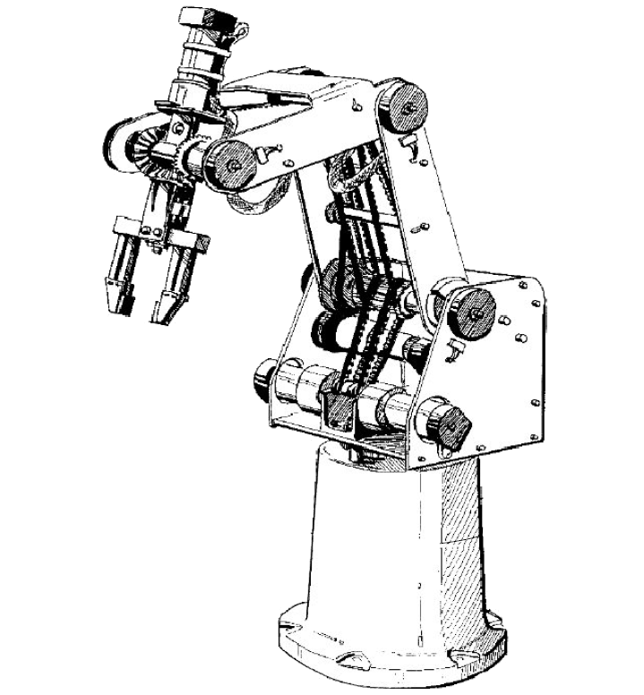

# OpenScorbot

>Controlador libre para el Scorbot ER-U4

## Motivación

La idea de desarrollar un controlador libre para el **Scorbot ER-4U** surgió a raíz de la
imposibilidad brazo accediendo directamente a sus motores por medio de un terminal. Esto no supone muchos problemas a nivel usuario, es decir, usos que no requieran el uso de cinemáticas ya sean directas o inversas. Sin embargo, si se requiere un control sobre estos parámetros o un **control a bajo nivel** del robot, con el [*software*](https://www.intelitek.com/robots/robotic-software/scorbase/) disponible no es posible.

Por ello, se propone crear un controlador propio y libre que permita acceder a los elementos
básicos a la hora de controlar el robot, saber el estado de sus sensores y además ser capaz de dar órdenes de movimiento.

## Recursos

- [Wiki del proyecto](https://github.com/tidus747/openScorbot/wiki)

## Software utilizado

El software utilzado para el desarrollo de este controlador ha sido el siguiente:

- [Python 2.7](https://www.python.org/download/releases/2.7/) - Lenguaje de programación de alto nivel.

## Referencias

Las referencias consultadas durante el desarrollo han sido las siguientes:

- [Estudio y análisis de las comunicaciones en el robot Scorbot-ER 4u](https://accedacris.ulpgc.es/bitstream/10553/25527/1/0742414_00000_0000.pdf)
- [Manual de usuario del Scorbot ER-4U](ftp://ftp.robotec.co.il/Techsup/er4pcspanish/100269-a%20ER_4pc_Span.pdf)
- [Simulador 3D y generador de trayectorias para el Scorbot ER-4U](https://github.com/icoderaven/aar-arm)
- [Toolbox de MATLAB para el control del Scorbot](https://github.com/kutzer/ScorBotToolbox  )
- [Controlador para el Scorbot ER-4U basado en ARDUINO](https://github.com/amiravni/Scorbot)
- [Estudio sobre la cinemática inversa del Scorbot ER-U4](https://www.researchgate.net/publication/274961840_Inverse_kinematics_solution_for_trajectory_tracking_using_artificial_neural_networks_for_SCORBOT_ER-4u)
