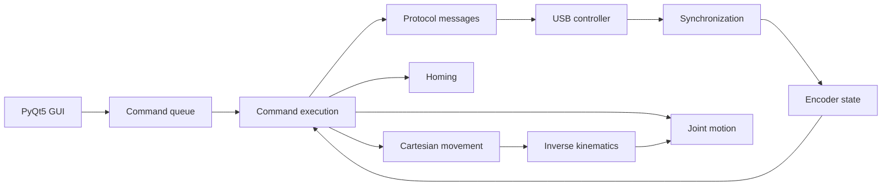
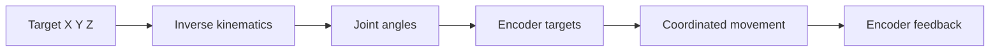

# OpenScorbot

Open low-level control project for the Scorbot ER-4U robotic arm.


## Overview

OpenScorbot explores direct control of the Scorbot ER-4U beyond the limitations of the original user-facing software.

The project works close to the controller and robot state, including:

- USB communication with the original controller
- controller initialization and synchronization
- encoder-state handling
- joint-level movement
- homing using limit switches
- Cartesian target movement
- inverse kinematics
- operator GUI
- physical homing and encoder tooling

This is a historical robotics project and should be read as an engineering implementation and reference, not as a modern production robotics framework.

## System architecture


```mermaid
flowchart LR
    UI[PyQt5 GUI] --> Q[Command queue]
    Q --> EXEC[Command execution]

    USB[USB controller] --> SYNC[Synchronization]
    SYNC --> STATE[Encoder state]
    STATE --> EXEC

    EXEC --> PROTO[Protocol messages]
    PROTO --> USB

    EXEC --> JOINT[Joint motion]
    EXEC --> HOME[Homing]
    EXEC --> XYZ[Cartesian movement]

    XYZ --> IK[Inverse kinematics]
    IK --> JOINT
```

See [docs/architecture.md](docs/architecture.md) for the detailed software and control view.

## Main capabilities

### Direct controller communication

The application uses PyUSB to locate and communicate with the Scorbot controller.

It handles:

- USB device discovery
- endpoint configuration
- controller initialization
- protocol message exchange
- sequence synchronization

Low-level message definitions live primarily in `openScorbot/libhex.py`.

### Joint motion

The motion layer supports the main robot axes:

- hip
- shoulder
- elbow
- wrist pitch
- wrist roll
- gripper

Movement logic uses encoder state and controller error feedback.

### Homing

`openScorbot/setHome.py` implements the homing sequence using limit switches and encoder feedback.

The goal is to establish a known reference state before normal movement.

### Cartesian motion

`openScorbot/moveXYZ.py` converts Cartesian targets into joint targets and then into encoder movement.


```mermaid
flowchart LR
    XYZ[Target X Y Z] --> IK[Inverse kinematics]
    IK --> ANG[Joint angles]
    ANG --> ENC[Encoder targets]
    ENC --> MOVE[Coordinated movement]
    MOVE --> FB[Encoder feedback]
```

### Configuration

`openScorbot/conf.py` defines and generates runtime configuration including:

- timing
- encoder positions
- error thresholds
- homing parameters
- link geometry
- inverse-kinematics parameters

## Physical tooling

The repository also contains mechanical artifacts under `models/`:

- encoder-related 3D models
- STL and OpenSCAD files
- homing jig resources
- DXF and SVG manufacturing files

This is an important part of the project because robot control and calibration are not purely software problems.

## Repository map

```text
openScorbot/
|-- docs/
|   |-- architecture.md
|   `-- project-context.md
|-- images/
|-- models/
|   |-- encoder/
|   `-- home_jig/
|-- openScorbot/
|   |-- gui.py
|   |-- libcomm.py
|   |-- libdef.py
|   |-- libhex.py
|   |-- libsync.py
|   |-- moveXYZ.py
|   |-- setHome.py
|   `-- ...
|-- references/
|-- src/
|-- CONTRIBUTING.md
|-- LICENSE
`-- README.md
```

## Attribution

This repository contains work by multiple contributors.

Several source files explicitly credit:

- Jose Luis Perez Perez
- Yolanda M. Gimeno Rodriguez

Other repository material and project history include work by Iván Rodríguez-Méndez.

The original source-level attribution is intentionally preserved.

See [docs/project-context.md](docs/project-context.md) for additional context.

## Historical environment

The codebase reflects the development environment used at the time, including:

- Python 3.6-era code
- PyQt5
- PyUSB
- direct control of the original Scorbot ER-4U controller

The software has not been modernized to current Python or robotics frameworks as part of this repository refresh.

## Safety

This project can command real robot motion.

Any change to communication, homing or movement logic should be considered hardware-affecting and validated carefully on compatible equipment.

## Development workflow

The original history is preserved. Current maintenance uses GitFlow without rewriting legacy commits.

See [CONTRIBUTING.md](CONTRIBUTING.md).

## References

The repository contains the Scorbot manual under `references/` and the original project README referenced additional work related to:

- Scorbot communications
- simulation and trajectory generation
- MATLAB control tooling
- Arduino-based Scorbot controllers
- inverse kinematics

## License

Released under the GNU General Public License v3.0. See [LICENSE](LICENSE).
