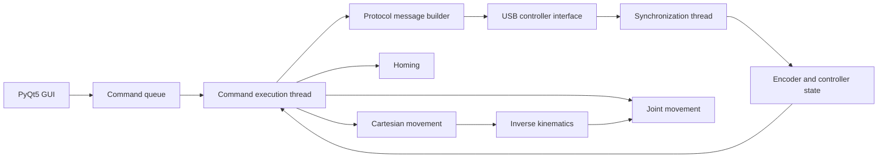
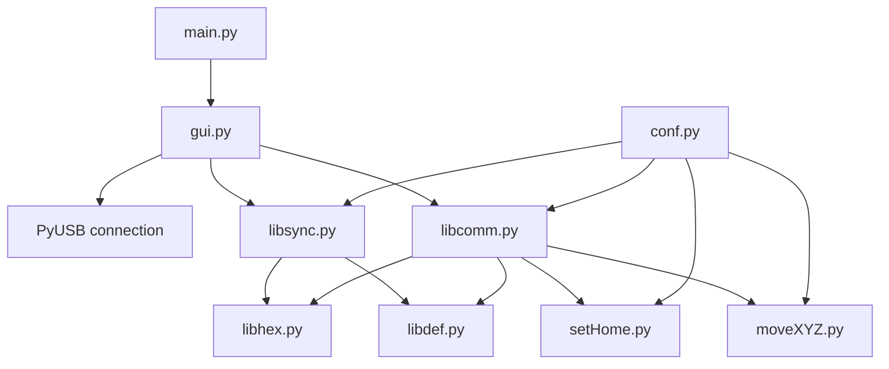

# Architecture

## System overview

OpenScorbot is a low-level control project for the Scorbot ER-4U robotic arm.

The application communicates directly with the robot controller over USB, maintains a synchronization loop, reads encoder state and executes joint or Cartesian movement commands.

## Runtime structure

## Communication layer

The controller interface is handled through PyUSB.

The software:

- locates the robot controller by USB vendor and product identifiers
- detaches the active kernel driver when required
- resolves input and output endpoints
- initializes the controller through a sequence of protocol messages
- keeps a synchronization thread running during operation

The low-level message templates are concentrated in `libhex.py`.

## Synchronization

`libsync.py` is responsible for the initial controller handshake and for maintaining the sequence/state exchange while the robot is connected.

Two queues are especially important:

- synchronization byte queue
- encoder-state queue

This allows the execution thread to work against updated controller state.

## Motion control

`libcomm.py` contains joint-level movement logic.

The code handles:

- hip motion
- shoulder motion
- elbow motion
- wrist pitch and roll
- gripper movement
- error feedback
- encoder-based position tracking

## Homing

`setHome.py` implements the robot homing sequence.

The process uses joint limit switches and encoder feedback to establish a known reference state before normal motion.

## Cartesian motion

`moveXYZ.py` handles Cartesian target movement.

The high-level path is:

The conversion parameters and link geometry are stored in the generated configuration data.

## Configuration

`conf.py` generates and reads `data.json`, including:

- timing values
- encoder positions
- error thresholds
- joint homing values
- link dimensions
- inverse-kinematics parameters

## Physical tooling

The repository also includes mechanical support tooling:

- encoder-related 3D models
- a homing jig
- DXF and SVG manufacturing files

These files live under `models/`.

## Historical status

The current implementation is a legacy robotics project built around:

- Python 3.6-era code
- PyQt5
- PyUSB
- direct communication with the original Scorbot ER-4U controller

The repository should be treated as a historical engineering implementation and reference. Real validation requires compatible robot hardware.
