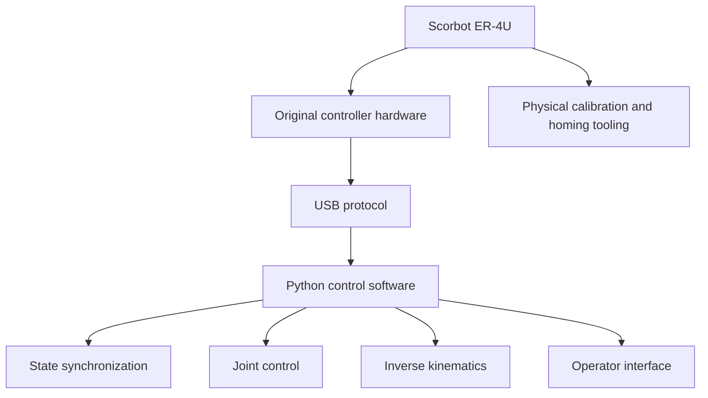

# Project Context

## Purpose

OpenScorbot was created to explore low-level control of the Scorbot ER-4U robot beyond the limitations of the original user-facing software.

The project focuses on direct access to:

- controller communication
- motor commands
- encoder state
- homing
- coordinated motion
- Cartesian target movement

## Collaboration and attribution

This repository contains material produced by multiple contributors.

Several source files explicitly credit:

- Jose Luis Perez Perez
- Yolanda M. Gimeno Rodriguez

Other repository material and project history include work by Iván Rodríguez-Méndez.

Those original source-level credits are intentionally preserved.

This repository should therefore be understood as a collaborative and historical robotics project rather than as the work of a single author.

## Engineering relevance

The project is useful as an engineering case study because it crosses several layers:

The key challenge is not only robot kinematics. It is the integration of controller protocol knowledge, encoder feedback, timing, safety limits, synchronization and motion generation.

## Current maintenance approach

The goal of current repository maintenance is documentation and preservation.

The project is not being represented as a modern production robotics framework.

Any future modernization should preserve:

- original contributor attribution
- historical protocol behavior
- hardware assumptions
- the distinction between verified legacy behavior and newly introduced behavior
